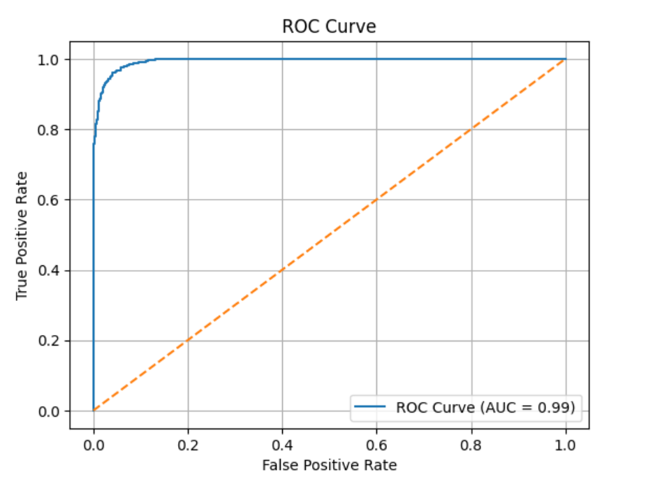
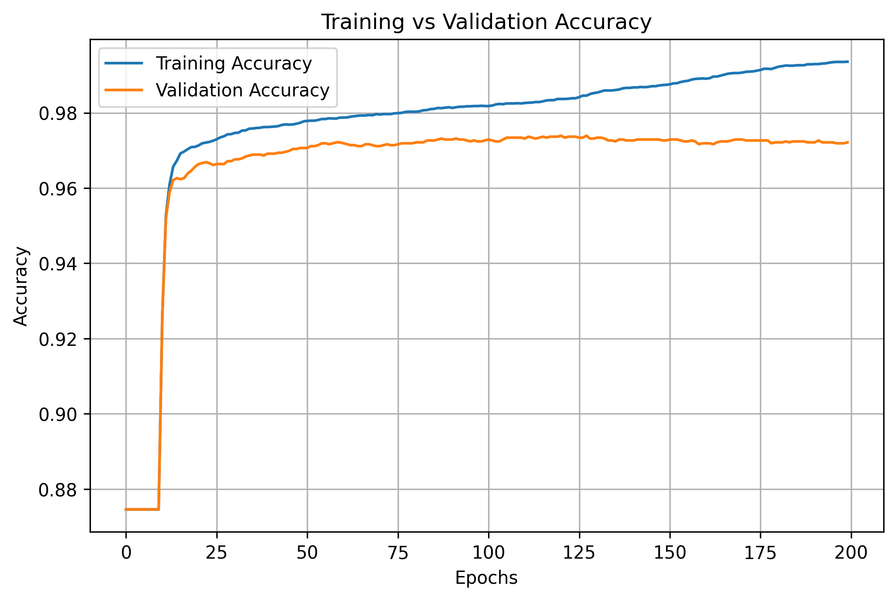
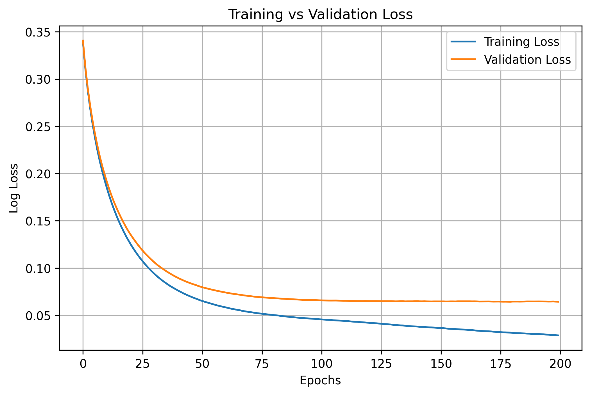
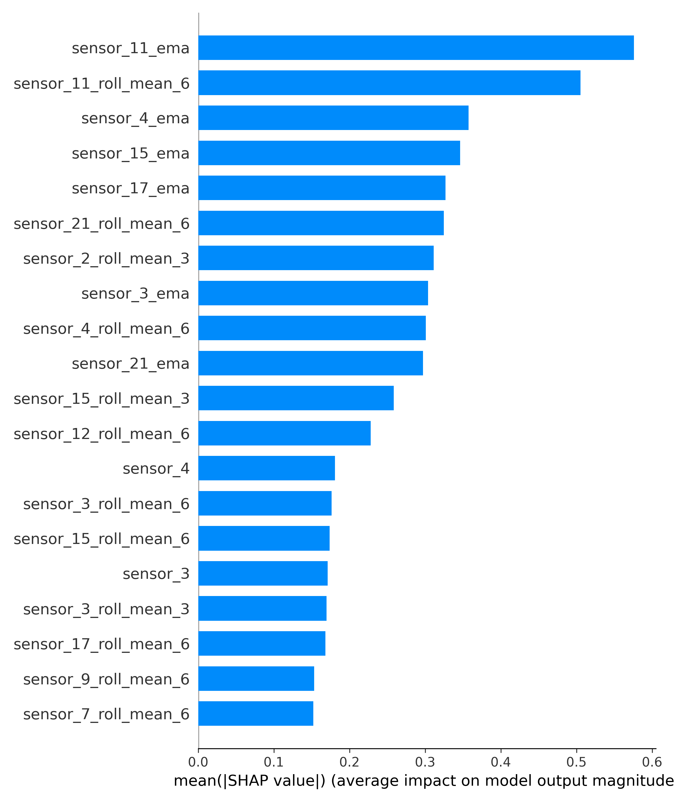

# IoT-Based Predictive Maintenance using Machine Learning

## Project Overview
This project implements an IoT-based Predictive Maintenance system using Machine Learning techniques to identify potential equipment failures before they occur.  
Sensor data collected from industrial machines is processed, analyzed, and modeled using multiple machine learning algorithms.  
The best-performing model is deployed using a Flask web application for real-time prediction.

---

## Organization / Company
[INFOTACT SOLUTIONS]

---

## Team Members
- [ Sk.Salma ] – [TEAM LEADER]
- [ B.Rohith] – [TEAM MEMBER]
- [ Kunalika Guha] – [TEAM MEMBER]
- [ Ofeh-Mamuzoh Elozino Shekinah] – [TEAM MEMBER]

---

## Objectives
- To analyze IoT sensor data for predictive maintenance
- To train and evaluate multiple machine learning algorithms
- To identify the best-performing model based on evaluation metrics
- To interpret model predictions using Explainable AI techniques (SHAP)
- To deploy the trained model using a Flask web application

---

## Dataset Used
- Dataset Name: C-MAPSS / Industrial IoT Sensor Dataset  
- Source: NASA Turbofan Engine Degradation Dataset  
- File: `raw_sensor_data.csv.zip`

### Dataset Description
The dataset contains time-series sensor readings collected from industrial machines operating under varying conditions.  
Each record includes:
- Machine ID
- Cycle number
- Operational settings
- Multiple sensor measurements

---

## Data Preprocessing
- Removal of irrelevant and constant features
- Handling of missing values
- Feature scaling using StandardScaler
- Failure label generation based on Remaining Useful Life (RUL)
- Final processed dataset saved as `processed_data.csv`

---

## Machine Learning Models Implemented
The following models were trained and evaluated:

| Model | Accuracy |
|------|---------|
| Logistic Regression | 95.0% |
| Random Forest | 97.0% |
| XGBoost | **97.2%** |

The XGBoost classifier achieved the best overall performance and was selected as the final model.

---

## Model Evaluation Metrics
The models were evaluated using the following metrics:
- Accuracy
- Precision
- Recall
- F1-score
- ROC Curve (AUC)
- Confusion Matrix

### Confusion Matrix


### ROC Curve


---

## Training Performance
### Training Accuracy


### Training Loss


---

## Explainable AI (SHAP)
SHAP (SHapley Additive exPlanations) was used to interpret and explain model predictions.

### SHAP Summary Plot


### SHAP Beeswarm Plot


These visualizations explain the contribution of individual sensor features to the model’s predictions.

---

## Final Model Selection
- Best Model: XGBoost Classifier  
- Selection Criteria: Highest accuracy, strong recall for failure cases, and robust generalization on unseen data

---

## Deployment
A Flask web application was developed to deploy the trained model.

### Deployment Files
- `app.py` – Flask application
- `factoryguard_xgb_model.pkl` – Trained model
- `scaler.pkl` – Feature scaler

To run the application locally:
```bash
python app.py

